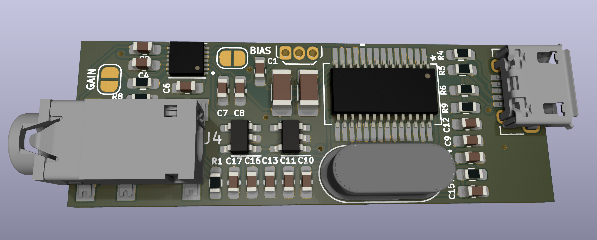
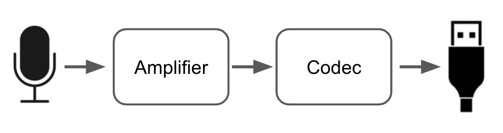
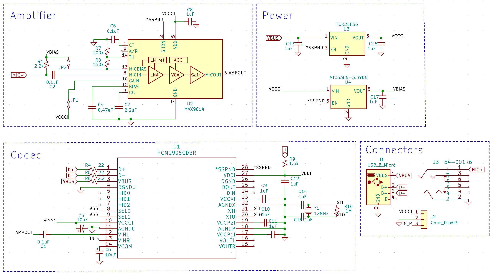
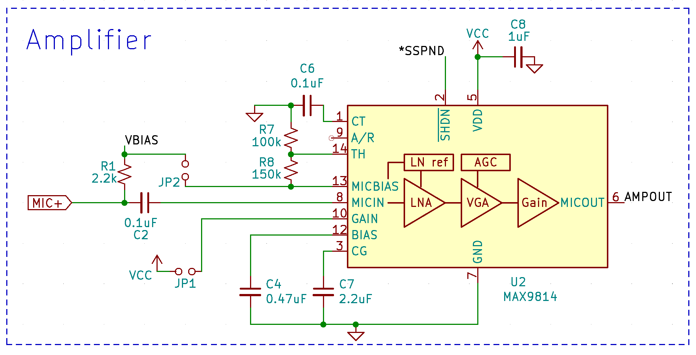
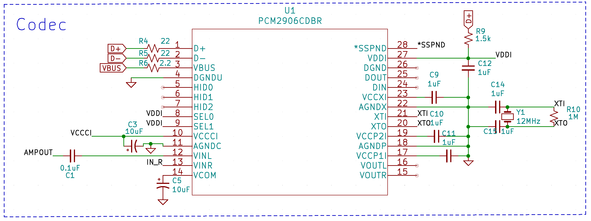
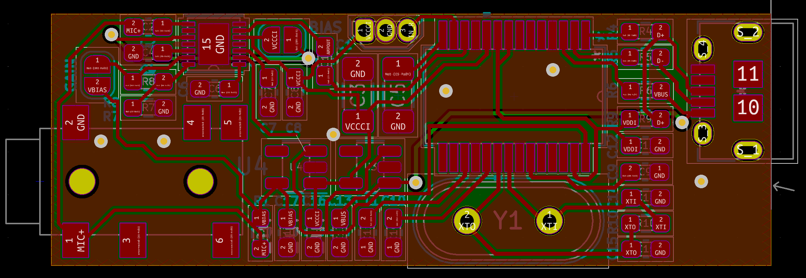

# USB Microphone Interface

This is a DIY USB microphone interface designed for an electret condenser microphone. It has up to 60dB of amplification and 16-bit ADC. This is my first PCB design and this page is intended to document the design itself, as well as my learnings along the way.

The project was created in [KiCad 6](https://www.kicad.org/)

I haven't yet assembled or tested this board, will update when I do.

## Why? 
Mostly as an excuse to design and build a PCB - you can buy something to do the same thing for $10 on Amazon. I'm a software engineer professionally, but did my degree in Electrical and Computer engineering and always wanted to design a board from scratch to feel like a *real engineer*. 😆 Given that, I wouldn't take anything here as authoritative or good practice.

I did go a little over-the-top and design this with probably way more performance and features than necessary, but that's the fun of building things yourself!
## Design Overview
A USB Microphone interface sounds pretty complicated, but luckily there are off-the-shelf components that do everything we need so this design is quite simple with two main components: an amplifier (the little chip) and a USB codec (the big chip).

In case you're unfamiliar with electronic design, component manufacturers publish datasheets for each part that document the part itself but also typically show you an example circuit of how to use it (making it easier to use the parts sells more parts). That means putting together a design like this is mostly an exercise of reading the datasheet carefully and wiring things up the way they show you, but inevitably there are aspects that are left out/unclear/assume you know what you're doing, so things aren't quite *that* simple.

### Amplifier
The first step in building a microphone interface is interfacing with a microphone, which is where the amplifier comes in. I chose the the [MAX9814](https://datasheets.maximintegrated.com/en/ds/MAX9814.pdf), primarily because it has built-in auto-gain-control (AGC) that will decrease the amplification to prevent the output from clipping loud input signals. It has three gain settings that go up to 60dB (which seems like a lot), and provides 2V bias for the microphone. 

[Electret microphones](https://en.wikipedia.org/wiki/Electret_microphone) are actually a combo microphone/amplifier-transistor, and that transistor requires a bias voltage to operate. Check out this [Open Music Labs](http://www.openmusiclabs.com/learning/sensors/electret-microphones/) page for a great explanation of electret microphones.

The amplifier microphone bias is 2V, but some high-performance microphones are rated for 3V, so I've added a 3V bias supply that is connected to the microphone by default, and a optional jumper for the amplifier-supplied 2V. If you want 2V, simply leave the 3V voltage regulator off (of cut the trace) and solder the jumper pads to connect the 2V bias.

### Codec
Once the analog microphone signal is amplified we need to digitize it with an analog-to-digital converter (ADC) and send that over USB in a format that computers recognize. The ADC part isn't too complicated, but USB definitely is, so luckily TI makes the [PCM2906](https://www.ti.com/lit/ds/symlink/pcm2906c.pdf) chip that does all of this (and more)! 

This chip is rather expensive (currently over $12 on [Digikey](https://www.digikey.com/en/products/detail/texas-instruments/PCM2906CDBR/3077993)) and could be replaced by a standalone ADC and microcontroller to reduce cost, but doing so would increase design complexity and require custom software for the USB interface. I might try that as a follow-up design later, but want to keep things simple here which this chip does.

## Schematic
Now that we know the parts involved let's see how everything is wired up! 

Again, most of this comes straight from the "Typical Application Circuit" examples in the datasheets (page 11 in the [MAX datasheet](https://datasheets.maximintegrated.com/en/ds/MAX9814.pdf) and page 24 in the [PCM2906](https://www.ti.com/lit/ds/symlink/pcm2906c.pdf)), so I'll focus on the differences and challenges in going from those to this design.

#### Signal Names:
The first thing to point out is that a lot of the wires in the schematic end with a label. All of the wires with the same labels are connected, and the label meanings are as follows:
* **VBUS**: USB +5V power
* **VCCCI**: analog supply voltage (3.6V) - I will refer to this as Vcc
* ***SSPND**: active-low enable for analog components (0V = enabled)
* **AMPOUT**: amplifier output
* **D+**, **D-**: USB signal lines

Starting with the simple stuff, in the bottom-right Connectors section you see the USB and Microphone connectors, along with an expansion header that brings out power, ground, and the right audio channel.

The top-right is the power-supply section, which takes the (noisy) 5V USB power supply and uses linear voltage regulators to produce 3.6V and 3V. Linear regulators are designed to produce the desired voltage regardless of the input voltage, and whatever difference is wasted as heat. They aren't usually the most efficient (though for a small difference between input and output voltage they can be), but they produce a very smooth output and reject noise that may be on the input supply which is important for the analog audio circuitry here.

### Amplifier

Starting at the top, the shutdown pin (`SHDN` - the line over it means it is inverted logic so logic-low (0V) = shutdown) is wired to the `*SSPND` label (asterisk in place of the bar over the word, same meaning) rather than permanently connected to Vcc as in the datasheet. The `*SSPND` line allows the PCM to power the analog circuitry off when the microphone is not in use.

Moving to the left you can see the positive microphone input line (`MIC+`) is connected through `R1` to both a label `VBIAS` as well as the `MICBIAS` pin of the amplifier through a jumper. As mentioned earlier, this board has both 3V and 2V mic bias supplies. The 3V is on `VBIAS` and is connected by default, and the 2V comes from the amplifier on `MICBIAS` and can be connected by the jumper, being sure to either leave off the 3V regulator or cut the trace. I'm not sure if anything bad would happen if they were both connected, but my guess is the amplifier wouldn't like its bias output to be connected to a higher voltage so I wouldn't recommend that.

Below the microphone lines you'll notice jumper `JP1` between the `GAIN` pin and Vcc. The gain pin configures the maximum gain of the amplifier. Unconnected = 60dB, Ground = 50dB, and Vcc = 40dB. By default I have it unconnected to get the full 60dB range, but I thought that might be too much so added a solder jumper to allow that to be reduced to 40dB.

The amplifier output is on the right which goes to the `AMPOUT` label.

### Codec

The main aspect of the codec I struggled with was how to connect the amplifier output - whether I could just connect them directly or if I needed some sort of matching circuitry. As you can see in the schematic, I only have a coupling capacitor between the two, which removes the bias voltage from the amplifier output and results in a 0V center voltage.

The MAX datasheet specifies that its output has a center-voltage of 1.23V which could be removed by placing a coupling capacitor in series. The PCM datasheet "Analog Input" section specified a center-voltage of Vcc/2, so I though that I needed to shift the output up by about 0.7V. Confusingly, the PCM datasheet example application ony showed coupling capacitors in front of the inputs - indicating 0V input bias.

I [asked](https://www.reddit.com/r/AskElectronics/comments/sm6ebf/audio_adc_input_bias/) on reddit and a couple people pointed out that the block diagram of the Analog frontend shows that the input is internally biased, so needed a 0V center voltage and all I needed was the coupling capacitor as the schematic showed. I still think the Analog Input section should have specified 0V instead of Vcc/2 center voltage.

## PCB Layout

To inspect the PCB layout I think you really need to download the project and use KiCad; there's a lot going on.

This layout went though a number of revisions and I learned a lot along the way. Making my own part footprints turned out to be really important. Some parts didn't have footprints available online, and even those that do should be inspected to make sure they actually match the datasheet.

I found the routing to be pretty difficult with KiCad (unsure if it's like this in all programs) because you can't 'move' the tra ces once you draw them, so rearranging things is quite time-consuming.

The board is almost single-sided; there were two power traces I put on the back side. I probably could have made a lot more use of the back side, but for some reason tried to minimize vias. 

All parts other than the crystal are surface-mount (SMD), and I went with 0603 size resistors/capacitors. I've never constructed a PCB with components this small, so that will be another learning experience for sure. My plan is to hotplate reflow solder the surface-mount components.